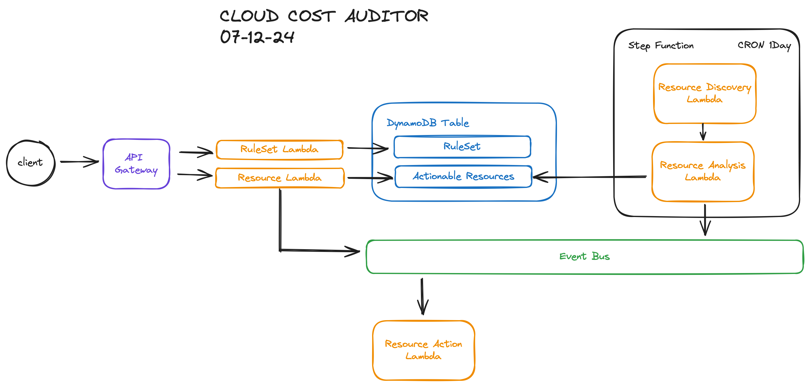

# Cloud Cost Auditor

Microservice that analyzes a cloud environment, gives insights and performs actions to reduce cost in your AWS cloud environment. A customizable ruleset allows the client to set custom behaviour, safeguards and the ability to allow the auditor to perform actions on your behalf.

## Architecture Diagram

